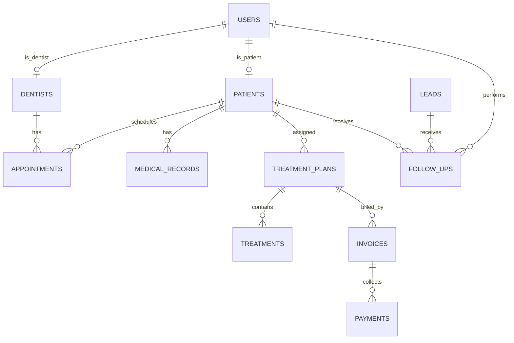

# Implementation Plan: Dental Clinic Management System

A comprehensive, web-based Dental Clinic Management System designed to centralize and automate clinic operations including patient files, appointment scheduling, treatment plans, invoicing, payments, CRM, and analytics.

---

## Technical Stack & Architecture

To deliver a high-performance, robust, and visually stunning web application without complex setup overhead, we propose the following stack:

*   **Backend**: Node.js with **Express** for a RESTful API.
*   **Database**: **SQLite** via `sqlite3` or `better-sqlite3`. It provides a full SQL relational database stored in a single local file, making it self-contained and trivial for the user to run locally without database server setups.
*   **Frontend**: Single Page Application (SPA) built using **Vanilla HTML5, ES6+ Javascript, and modern CSS3**.
    *   **Styling**: Vanilla CSS utilizing modern layouts (CSS Grid, Flexbox), custom CSS variables for design tokens, and a curated color palette (harmonious dark/light modes, glassmorphism, smooth micro-animations).
    *   **Typography**: Google Fonts (e.g., *Outfit* and *Inter*).
    *   **Icons**: FontAwesome or Lucide Icons (loaded via CDN).
    *   **Charts**: Chart.js (loaded via CDN) for the dashboard and reports.
*   **Authentication**: JWT (JSON Web Tokens) stored in secure, HTTP-only cookies, with role-based access control (RBAC) supporting **Admin**, **Dentist**, **Staff**, and **Patient** roles.

---

## User Review Required

> [!IMPORTANT]
> **Role-Based Access Control Boundaries**
> We have defined four roles:
> 1. **Admin**: Full access to all settings, financial data, and reports.
> 2. **Dentist**: Access to patients, appointments, medical records, treatment plans. No access to overall clinic financial reports or employee salary/billing settings.
> 3. **Staff (Receptionist)**: Access to scheduling, invoicing, payments, patients, and leads. Cannot modify medical history notes or dentist treatment records.
> 4. **Patient**: Limited portal access to view their own appointments, invoices, treatment plans, and book new appointments.
> 
> *Please confirm if this role mapping meets your expectations.*

> [!WARNING]
> **Online Booking Authentication**
> Should patient booking require patients to create an account first, or should they be able to book appointments as "guests" (providing name, email, and phone) which then auto-creates/matches a patient profile?
> *We recommend requiring registration or verification (e.g., email code check) to prevent spam bookings.*

---

## Open Questions

> [!IMPORTANT]
> **Local Server Execution**
> Do you have a preferred port for the local Express server? (We plan to use port `3000` by default).

---

## Database Design



### Table Schemas (Draft)
1.  **users**: `id`, `email`, `password_hash`, `role` (admin/dentist/staff/patient), `first_name`, `last_name`, `phone`, `created_at`
2.  **dentists**: `id`, `user_id` (FK), `specialization`, `license_number`, `color_code` (for calendar view)
3.  **patients**: `id`, `user_id` (FK, optional for guest/non-registered patients), `first_name`, `last_name`, `email`, `phone`, `date_of_birth`, `gender`, `address`, `medical_allergies`, `notes`, `created_at`
4.  **appointments**: `id`, `patient_id` (FK), `dentist_id` (FK), `start_time`, `end_time`, `status` (scheduled/completed/cancelled/no-show), `notes`
5.  **treatments**: `id`, `name`, `description`, `base_cost`
6.  **treatment_plans**: `id`, `patient_id` (FK), `dentist_id` (FK), `title`, `status` (draft/active/completed/cancelled), `total_cost`, `created_at`
7.  **treatment_plan_items**: `id`, `treatment_plan_id` (FK), `treatment_id` (FK), `tooth_number`, `notes`, `cost`, `status` (pending/completed)
8.  **invoices**: `id`, `treatment_plan_id` (FK), `patient_id` (FK), `amount_due`, `discount`, `tax`, `total_amount`, `amount_paid`, `status` (unpaid/partially_paid/paid), `due_date`, `created_at`
9.  **payments**: `id`, `invoice_id` (FK), `amount`, `payment_method` (cash/card/insurance), `transaction_ref`, `created_at`
10. **leads**: `id`, `first_name`, `last_name`, `email`, `phone`, `source` (web/referral/social), `status` (new/contacted/converted/lost), `created_at`
11. **follow_ups**: `id`, `patient_id` (FK, optional), `lead_id` (FK, optional), `assigned_to` (FK users), `scheduled_date`, `notes`, `status` (pending/completed), `completed_at`

---

## Proposed Changes

We will build the application dynamically across 4 logical Sprints.

### Project Foundation

#### [NEW] [package.json](file:///c:/Users/Admin/Desktop/Dental%20clinic%20management%20system/package.json)
Initialize npm package with dependencies: `express`, `better-sqlite3` (or `sqlite3` for native JS support), `bcryptjs`, `jsonwebtoken`, `cookie-parser`, and `dotenv`.

#### [NEW] [server.js](file:///c:/Users/Admin/Desktop/Dental%20clinic%20management%20system/server.js)
Main application entry point. Configures Express, SQLite database initialization, API routers, and static file serving for the SPA frontend.

#### [NEW] [db.js](file:///c:/Users/Admin/Desktop/Dental%20clinic%20management%20system/db.js)
Database connection setup, helper query functions, and seeding scripts to populate initial dentists, treatments, and admin user data.

### Frontend SPA Core

#### [NEW] [index.html](file:///c:/Users/Admin/Desktop/Dental%20clinic%20management%20system/public/index.html)
Main application frame. Contains navigation headers, sidebars, dynamic view container, and standard CDN links (Google Fonts, FontAwesome, Chart.js).

#### [NEW] [style.css](file:///c:/Users/Admin/Desktop/Dental%20clinic%20management%20system/public/style.css)
Sleek, responsive design system. Includes CSS variables (colors, spacing, shadows), light/dark themes, custom scrollbars, interactive animations, and responsive utilities.

#### [NEW] [app.js](file:///c:/Users/Admin/Desktop/Dental%20clinic%20management%20system/public/app.js)
Frontend SPA routing engine, authentication handlers, global state, and view-rendering orchestrator.

### Sprint Breakdown

```
Sprint 1: Base Architecture & Patient/Dentist Management (Days 1-5)
Sprint 2: Dental Operations & Treatment Plans (Days 6-10)
Sprint 3: Scheduling, Online Portal & Notifications (Days 11-15)
Sprint 4: Financials, Dashboard, Reports & Analytics (Days 16-20)
```

---

## Verification Plan

### Automated Verification
*   We will implement basic integration tests in `test.js` verifying user registration, login, appointment booking, and treatment plan creation endpoints.

### Manual Verification
*   **Dashboard View**: Verify real-time cards for appointment count, revenue, outstanding balances, and active treatment plans.
*   **Calendar Flow**: Test drag-and-drop or modal-driven appointment scheduling.
*   **Invoice Generation**: Verify that completing a treatment plan item correctly generates an invoice and updates patient balances.
